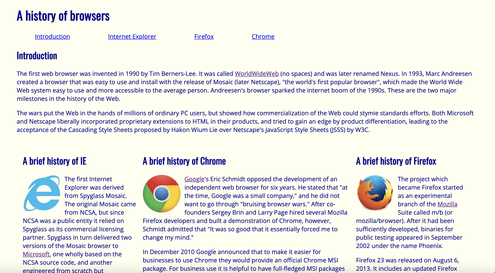
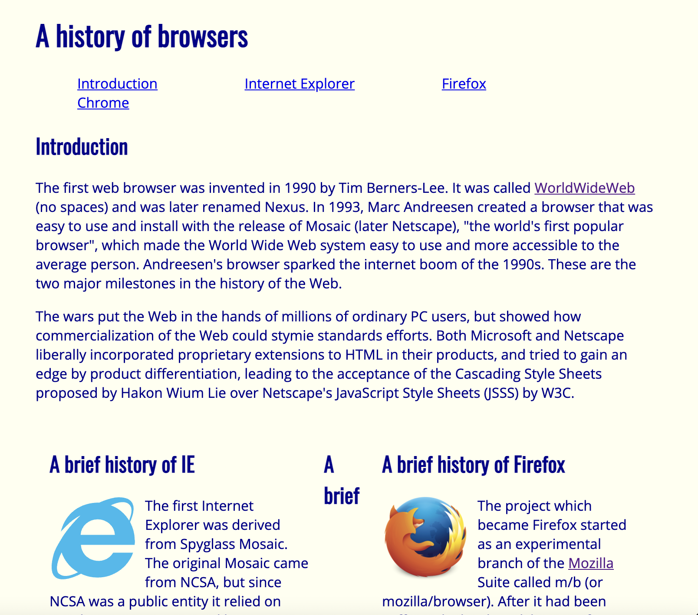
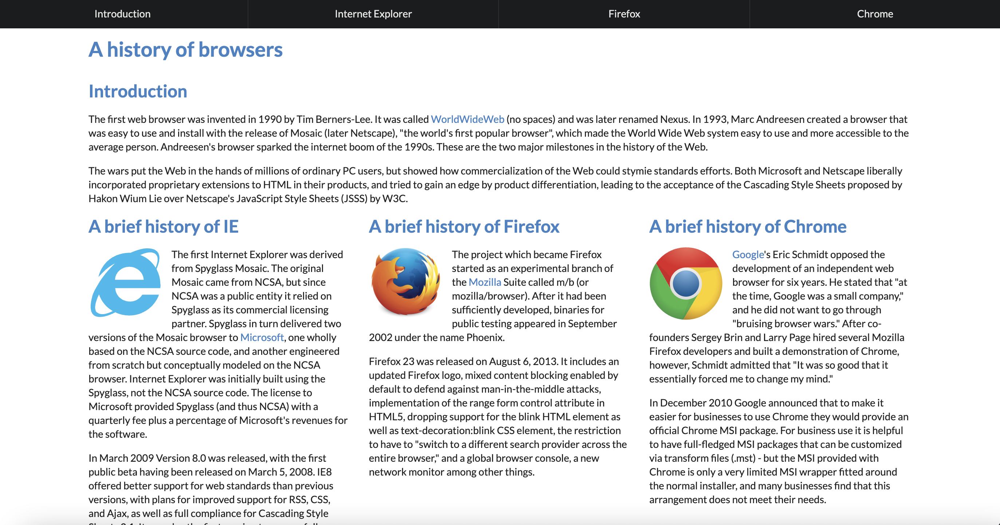
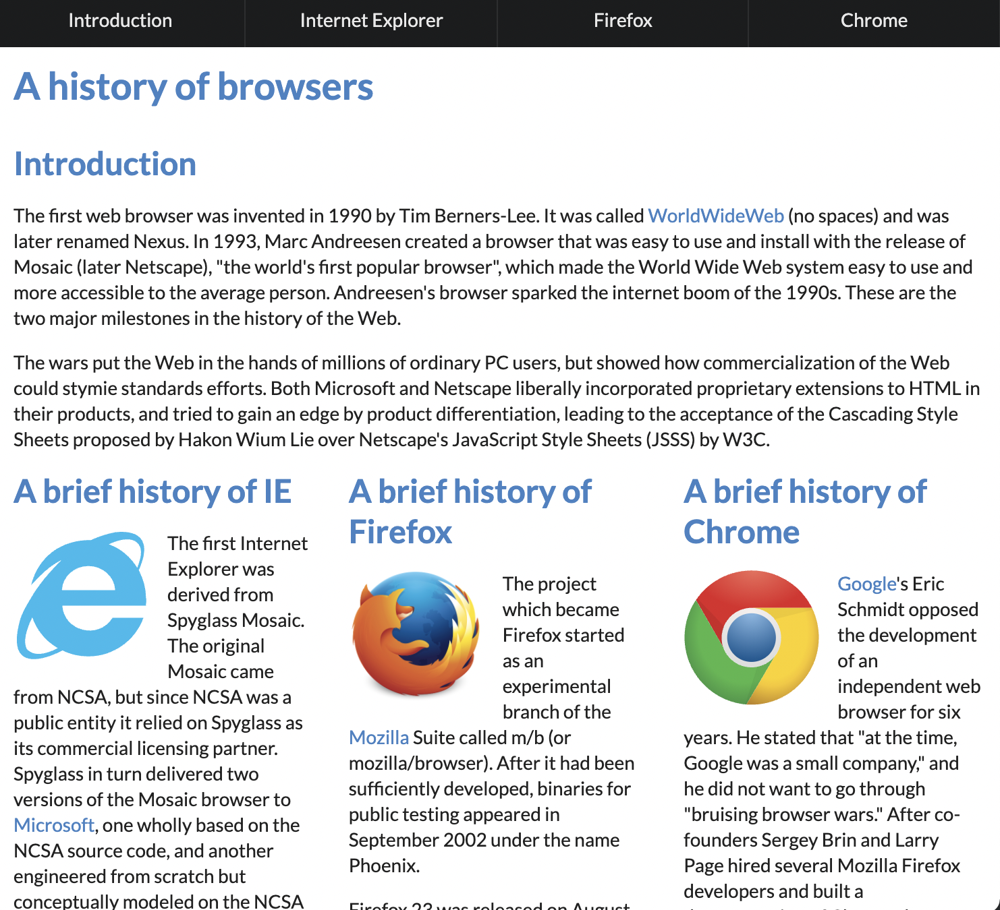

This past week I experienced using UI frameworks for the first time. I learned the concepts of and tried making a cople of web pages using Semantic UI. Semantic UI 
is a front-end development framework designed for theming. It contains pre-built semantic components that helps create modern and responsive layouts using human-friendly HTML. I found it really difficult to learn, and because I am quite new to HTML and CSS as well I found it all a bit confusing.

Even though I find UI Semantic difficult to learn. In my experience UI Semantic makes it a lot easier to get a modern look on your website fast. Collections like menus and grids makes this possible, and at would be a lot more difficult using raw HTML and CSS. I also find the class name logiacal and it feels like more natural English.

## Web page without UI Semantic

Underneath you can see images of two different web pages about browser history. I tried making this website using only raw HTML and CSS at first. You can see the result in the two first images, the left one is a screenshot of a big window and the right one is a screenshot of a narrower window. As you can see from the images the web page looks old fashioned, especially the menu on top. It is also easy to observe that the page does not adjust well when the window gets narrower. 

    

    
      

    

    
      

  

  
## Web page using UI Semantic
 
After making the web page using only raw HTML and CSS I tried making it using UI Semantic. In the images underneath you can see the different attemts first in a big window to the left, then in a narrower window. You can clearly see from these images that the webpage using UI Semantic looks a lot more modern and that it actually adjusts when the window is adjusted. You can still see the whole menu in one line and all the collumns and headers are visible. Using containers to get the page to adjust makes it a lot easier to make web pages. Having different elements, collections, views and modules makes it possible to design a modern web page quickly and it has almost everything you would want for building your page. On the other hand it is not possible to customize everything exactly as you may want to.

  

  

    
    

  

    
    

  

