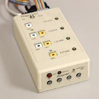

In this project our team developed a program for controlling one elevator with four floors. The program used sensors to determine wich buttons were being pushed and in wich floor the elevator was. The elevator was supposed to behave logically and all orders needed to be served. It also needed to meet some specified requirements, like how it should behace when the stop button was pushed or if there was a door obstruction. I was in a team with one other person and we did most of the project together and contributed the same amount. We distributed the workload between us and discussed if there were any issues.

In the beginning of the project we desiged our program using UML. We desiged the different modules such that they had high cohesion and as low coupling as possible. Ater the design was finished we implemented the code.

