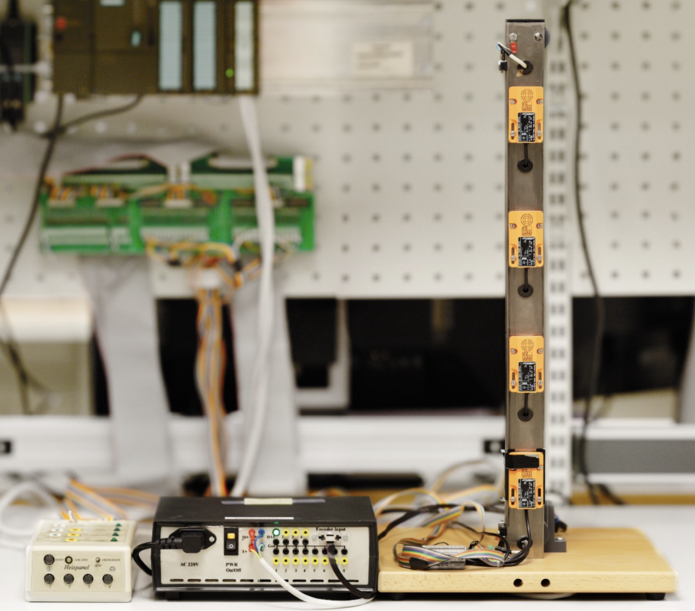

In this project my team programmed multiple elevators by creating software for controlling n elevators working in parallel across m floors. The elevators were supposed to sufficiently sereve cab and hall orders and work logically. No orders were supposed to be lost. The goal of the project was to make sure the program was ready for the Factory Acceptance Test(FAT) at a given date, as well as making a good design before the implementation began and writing good and readable code.

I had previously programmed one elevator (you can read more about this in my other project called *Elevator*). The difference in this project was to get the elevators to "talk" to each other and figuring out wich elevator should take each order. We used UDP to sed packets between the different elevator servers, we also took packet-loss into consideration. It was also important that the elevators continued serving orders as normal even if some network connections were lost or if the power to some elevators were lost.

We worked in a team of three people. My contribution to this project was to be a member of the team and I therefore contributed to both designing and implementing the code. I also took on the role as sort of a team-leader by making decisions and making sure the project progressed in the right direction.

Here is a link to the github repository with more information and source-code: [Multiple Elevators](https://github.com/TTK4145-Students-2021/project-gruppe32).
