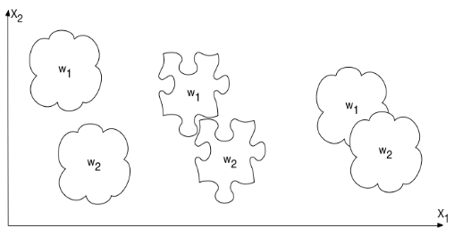
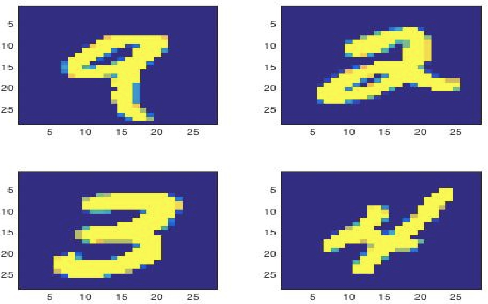

   *Different classification types*
   *The different variants of the Iris flower*
   *Examples of handwritten numbers*

This project was a part of the course content in "TTT 4275 - estimation, detection and classification". This project was solved in pairs of two. Classification is a way to separate and categorize different objects into groups or categories. Doing classification with a computer often implies using different algorithms combined with already pre-categorized training data. The goal with this project was to get some knowledge on how the linear classifier and the nearest neighbour method are implemented, trained, and how they work in practice. The goal was also to observe how computers manage to recognize the objects and use data to classify them correctly.

The first task used a linear classifier to classify three different variants of the Iris flower. 
The linear classifier was quite easy to implement and train, and work very well.

The second task used a template based classifier, with different variants of the nearest neighbour decision rule. This classifier was also quite simple to implement. The task was to use the different variants of the classifier to classify images of handwritten numbers from 0-9. The results of the different classifiers were a bit surprising, but overall the classifier work really well.

