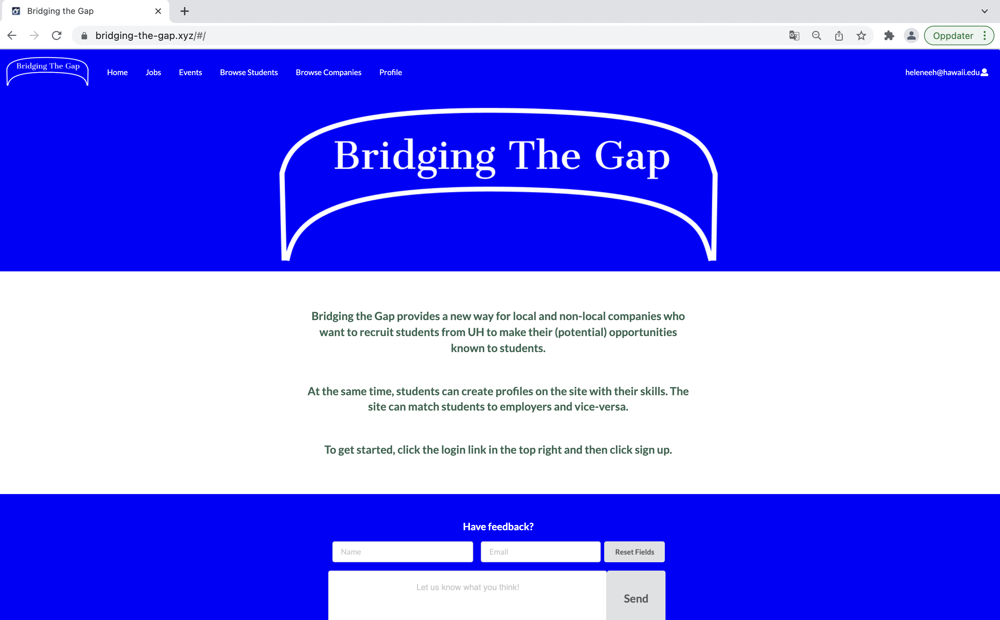

This project was the final project in the course "ICS 314 - Software Engineering  I". This is the first time I have made a complete and functional website. 
The goal of the project was to make a website that would be useful for the University of Hawaii at Manoa community. Our website tries to build a "bridge" between 
students and companies, such that students can learn more about opportunities like internships, part-time jobs, and jobs after graduation. We worked in a team of 
five people and used issue-driven management when working on the project. We worked in iterations with three different milestones and had different goals for 
each milestone. All team members worked on their own issues for all milestones but collaborated and discussed when having problems.

 *Landing page for "Bridging the Gap"*

On the website, both students and companies can sign up. Companies can add and edit job listings and events, they can also browse through students, and filter them by skills, 
and in this way get in contact with the students. Companies can also see all events, job listings and browse through all companies. Students can look through job listings and events, and favorite the ones that they find interesting. 
For the job listings, they can also click on a link that leads to the original listing on the company website, with more information. Students can also 
browse through companies, filtered by location, as well as browse through all students. All users can also add reports if for instance something does not work 
properly or something on the site is inappropriate. The admin user gets these reports and can decide what to do about the issues. The admin user can also add new 
choices for skills and locations as the users only can choose from a list when choosing these.

The web application was implemented using Javascript, Meteor, React, and Mongo DB. To collaborate we used the same IDEA; IntelliJ, ESlint coding standard, and Github. The team collaborated and designed the layout together, and all team members were each responsible for some pages. I was mainly responsible for the 
"Jobs", "Browse Students" and "Browse Companies" pages. I also collaborated with one other team member on the "Sign up" page, and helped other team members with 
their pages when needed, as we all did. I was also responsible for making the database collections "Profiles", "Locations" and "Skills"

From this project, I have learned how to develop and deploy a web application from scratch, which is something that I had never done before. 
I have also learned how to use databases and coding to build a website with continuous input from users, as well as gaining insight into how to work in a 
software development team using issue-driven management and tools like Github and project milestones to function optimally as a team.

Further information about the project can be found [here](https://bridging-the-gap.github.io), and the source code can be found [here](https://github.com/bridging-the-gap/bridging-the-gap)
